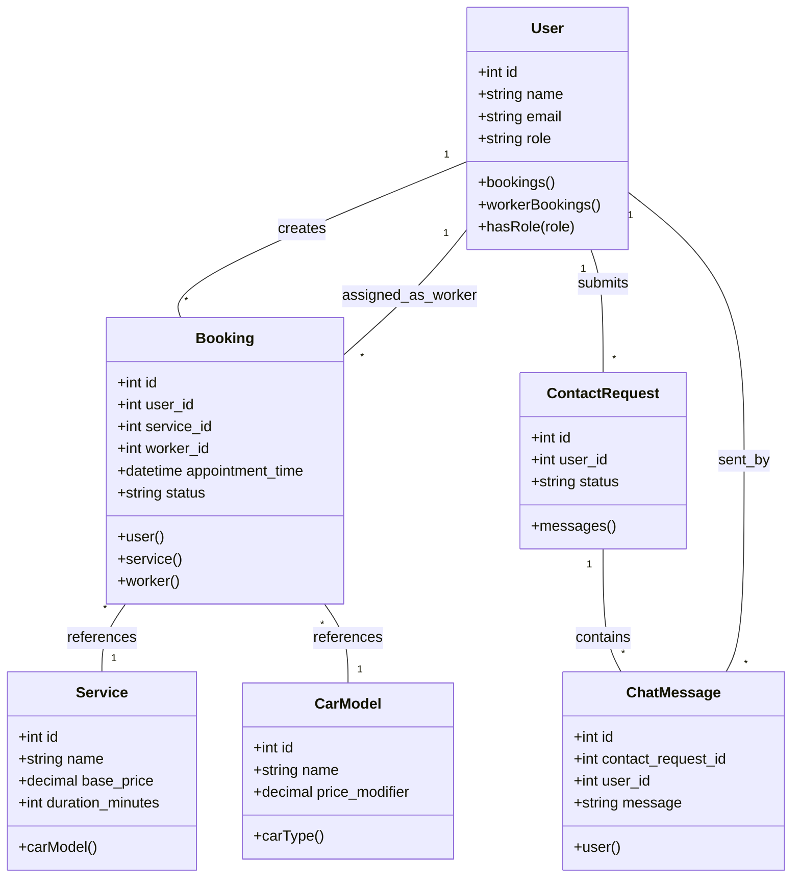

# Class Diagram

This diagram represents the core Object-Oriented structure of the application, focusing on the Laravel Eloquent models and their relationships.

```mermaid
classDiagram
    class User {
        +int id
        +string name
        +string email
        +string role
        +bookings()
        +workerBookings()
        +hasRole(role)
    }
    class Booking {
        +int id
        +int user_id
        +int service_id
        +int worker_id
        +datetime appointment_time
        +string status
        +user()
        +service()
        +worker()
    }
    class Service {
        +int id
        +string name
        +decimal base_price
        +int duration_minutes
        +carModel()
    }
    class CarModel {
        +int id
        +string name
        +decimal price_modifier
        +carType()
    }
    class ContactRequest {
        +int id
        +int user_id
        +string status
        +messages()
    }
    class ChatMessage {
        +int id
        +int contact_request_id
        +int user_id
        +string message
        +user()
    }

    User "1" -- "*" Booking : creates
    User "1" -- "*" Booking : assigned_as_worker
    Booking "*" -- "1" Service : references
    Booking "*" -- "1" CarModel : references
    User "1" -- "*" ContactRequest : submits
    ContactRequest "1" -- "*" ChatMessage : contains
    ChatMessage "*" -- "1" User : sent_by
```
