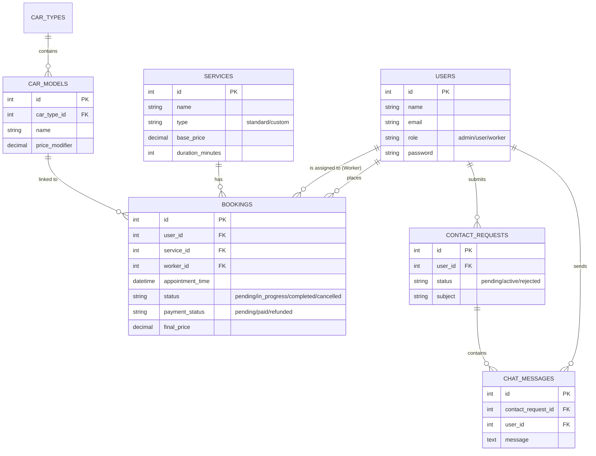

# Entity Relationship Diagram (ERD)

This diagram visualizes the database schema and the relationships between users, services, bookings, and messaging components.

```mermaid
erDiagram
    USERS ||--o{ BOOKINGS : "places"
    USERS ||--o{ CONTACT_REQUESTS : "submits"
    USERS ||--o{ CHAT_MESSAGES : "sends"
    USERS ||--o{ BOOKINGS : "is assigned to (Worker)"
    
    SERVICES ||--o{ BOOKINGS : "has"
    CAR_TYPES ||--o{ CAR_MODELS : "contains"
    CAR_MODELS ||--o{ BOOKINGS : "linked to"
    
    CONTACT_REQUESTS ||--o{ CHAT_MESSAGES : "contains"

    USERS {
        int id PK
        string name
        string email
        string role "admin/user/worker"
        string password
    }

    SERVICES {
        int id PK
        string name
        string type "standard/custom"
        decimal base_price
        int duration_minutes
    }

    CAR_MODELS {
        int id PK
        int car_type_id FK
        string name
        decimal price_modifier
    }

    BOOKINGS {
        int id PK
        int user_id FK
        int service_id FK
        int worker_id FK
        datetime appointment_time
        string status "pending/in_progress/completed/cancelled"
        string payment_status "pending/paid/refunded"
        decimal final_price
    }

    CONTACT_REQUESTS {
        int id PK
        int user_id FK
        string status "pending/active/rejected"
        string subject
    }

    CHAT_MESSAGES {
        int id PK
        int contact_request_id FK
        int user_id FK
        text message
    }
```
