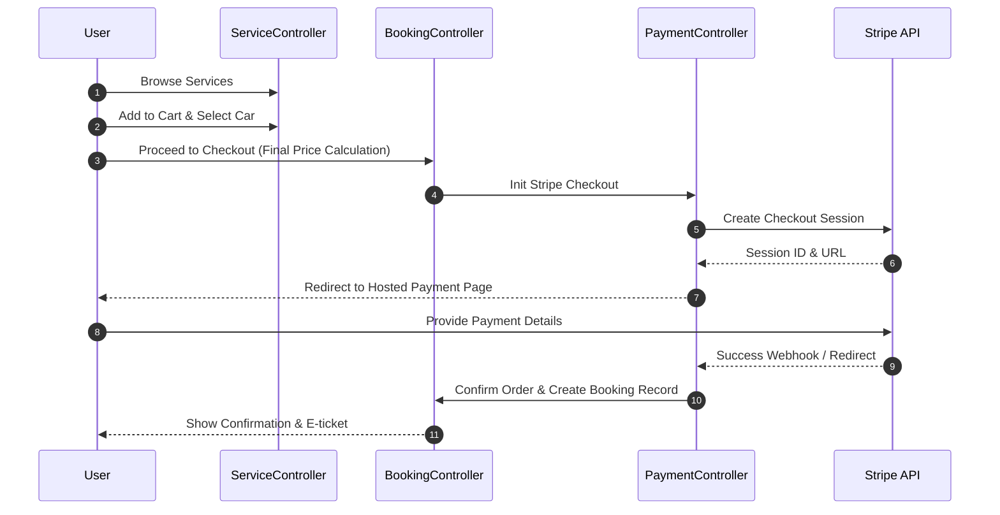
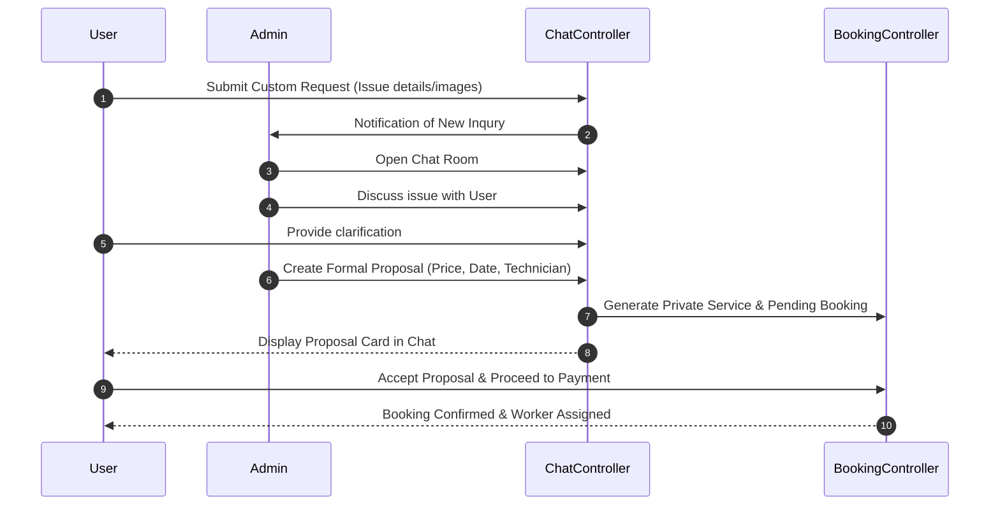

# Sequence Diagrams

These diagrams illustrate the chronological flow of interactions between users, the system controllers, and external APIs (like Stripe).

## 1. Standard Booking & Payment Flow

## 2. Custom Service Request & Proposal Flow

