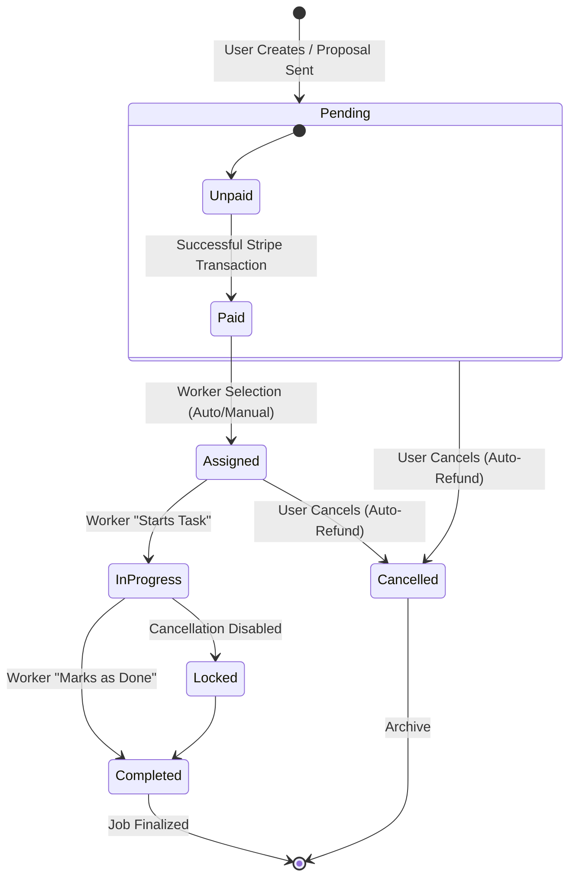

# State Diagram

This diagram represents the lifecycle of a **Booking** entity and the transitions between its various statuses.

```mermaid
stateDiagram-v2
    [*] --> Pending : User Creates / Proposal Sent
    
    state Pending {
        [*] --> Unpaid
        Unpaid --> Paid : Successful Stripe Transaction
    }

    Paid --> Assigned : Worker Selection (Auto/Manual)
    Assigned --> InProgress : Worker "Starts Task"
    InProgress --> Completed : Worker "Marks as Done"
    
    Pending --> Cancelled : User Cancels (Auto-Refund)
    Assigned --> Cancelled : User Cancels (Auto-Refund)
    
    InProgress --> Locked : Cancellation Disabled
    Locked --> Completed
    
    Completed --> [*] : Job Finalized
    Cancelled --> [*] : Archive
```
