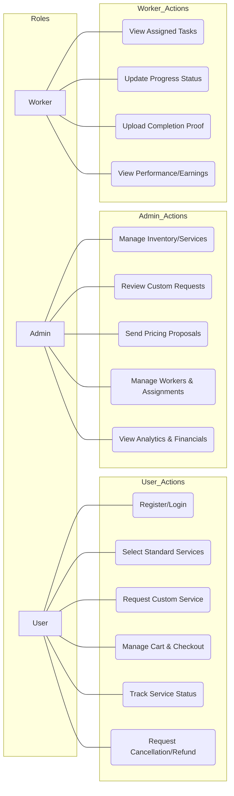

# Use Case Diagram

This diagram provides a high-level view of the system’s functionality from the perspective of its three primary actors.

```mermaid
graph LR
    subgraph Roles
        U[User]
        A[Admin]
        W[Worker]
    end

    subgraph User_Actions
        UA1(Register/Login)
        UA2(Select Standard Services)
        UA3(Request Custom Service)
        UA4(Manage Cart & Checkout)
        UA5(Track Service Status)
        UA6(Request Cancellation/Refund)
    end

    subgraph Admin_Actions
        AA1(Manage Inventory/Services)
        AA2(Review Custom Requests)
        AA3(Send Pricing Proposals)
        AA4(Manage Workers & Assignments)
        AA5(View Analytics & Financials)
    end

    subgraph Worker_Actions
        WA1(View Assigned Tasks)
        WA2(Update Progress Status)
        WA3(Upload Completion Proof)
        WA4(View Performance/Earnings)
    end

    U --- UA1
    U --- UA2
    U --- UA3
    U --- UA4
    U --- UA5
    U --- UA6

    A --- AA1
    A --- AA2
    A --- AA3
    A --- AA4
    A --- AA5

    W --- WA1
    W --- WA2
    W --- WA3
    W --- WA4
```
